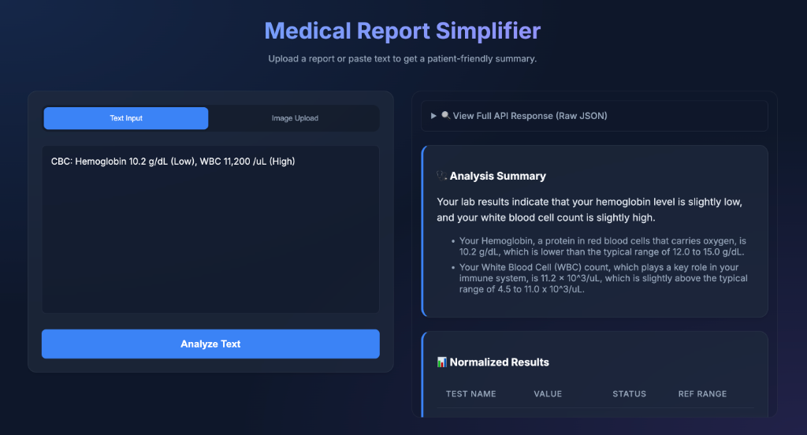

# AI-Powered Medical Report Simplifier
[[](https://medical-report-app.vercel.app/)


A smart web application that converts medical reports (text or images) into structured, patient-friendly JSON using Google Gemini's AI.



## 🚀 Key Features

*   **Web Interface**: Clean, glassmorphism-style UI for easy interaction (Mobile Responsive).
*   **Multi-Modal Input**: Accepts raw text OR images (OCR via Gemini Vision).
*   **Structured Output**: Normalizes test names, values, units, and status (High/Low/Normal).
*   **Patient-Friendly Summary**: Generates simple, non-diagnostic explanations.
*   **Strict Guardrails**: Prevents hallucination of tests not present in the input.

---

## 🛠️ Quick Start (Recommended)

This project is a **Node.js** application.

### 1. Prerequisites
*   Node.js 18+ installed.
*   Google Gemini API Key (Get it from [Google AI Studio](https://aistudio.google.com/app/apikey)).

### 2. Setup
```bash
# Clone repository
git clone https://github.com/dk2430098/MedicalReportApp.git
cd MedicalReportApp

# Install dependencies
npm install

# Configure API Key
echo "GOOGLE_API_KEY=your_actual_api_key_here" > .env
```

### 3. Run the App
```bash
node server.js
```
Open your browser to: **http://localhost:8000**

---

## ☁️ Deployment (Split Architecture)

To avoid serverless timeouts, we split the application:
*   **Backend (API)**: Hosted on **Render** (Node.js).
*   **Frontend (UI)**: Hosted on **Vercel** (Static).

### 1. Deploy Backend (Render)
1.  Push code to GitHub.
2.  Create a **Web Service** on [Render](https://render.com).
3.  **Settings**:
    *   Build Command: `npm install`
    *   Start Command: `node server.js`
    *   Env Var: `GOOGLE_API_KEY` = `your_gemini_key`
4.  Copy your **Render URL** (e.g., `https://myapp.onrender.com`).

### 2. Configure Frontend
1.  Open `public/script.js`.
2.  Update `API_BASE_URL` with your Render URL:
    ```javascript
    const API_BASE_URL = 'https://myapp.onrender.com';
    ```

### 3. Deploy Frontend (Vercel)
1.  Run `vercel`.
2.  **Preset**: Choose **Other**.
3.  **Root Directory**: `./` (Default).
4.  **Deploy!**

---

## 🔌 API Documentation

You can use the backend independently via Postman or cURL.

### Base URL
`https://medicalreportapp.onrender.com` (or your Render URL)

### 1. Process Text
*   **Endpoint**: `/process`
*   **Method**: `POST`
*   **Headers**: `Content-Type: application/json`
*   **Body**:
    ```json
    {
      "text": "Patient: John Doe. WBC: 5.0 (Normal). Hemoglobin: 12.5 g/dL."
    }
    ```

### 2. Process Image
*   **Endpoint**: `/process-image`
*   **Method**: `POST`
*   **Body**: `form-data`
    *   `file`: (Upload Image File)

### 3. Keep-Alive (Cron Job)
*   **Endpoint**: `/ping`
*   **Method**: `GET`
*   **Response**: `{"status": "ok", "message": "Server is awake"}`

---

## 🐍 Advanced: Using Python (CLI / Backend)

*(Optional) If you prefer a Python-only environment.*

### Setup
```bash
pip install -r requirements.txt
```

### CLI Usage
**Process Text:**
```bash
python3 main.py --text "CBC: Hemoglobin 10.2 g/dL (Low)"
```

**Process Image:**
```bash
python3 main.py --image path/to/report.jpg
```

### Python API Server
Start the FastAPI server (backend only, no UI):
```bash
python3 app.py
```
*(Runs at `http://0.0.0.0:8000`)*

---

## 📁 Project Structure

```
├── server.js           # PRIMARY: Node.js Express Backend & Static Server
├── public/             # PRIMARY: Frontend Web App (HTML/CSS/JS)
│   ├── index.html
│   ├── style.css
│   └── script.js
├── vercel.json         # Deployment Configuration
├── main.py             # SECONDARY: Python CLI Tool
├── app.py              # SECONDARY: Python FastAPI Backend
├── prompts.py          # Shared AI Logic & Systems Prompt
└── requirements.txt    # Python Dependencies
```

## 📝 License
MIT
